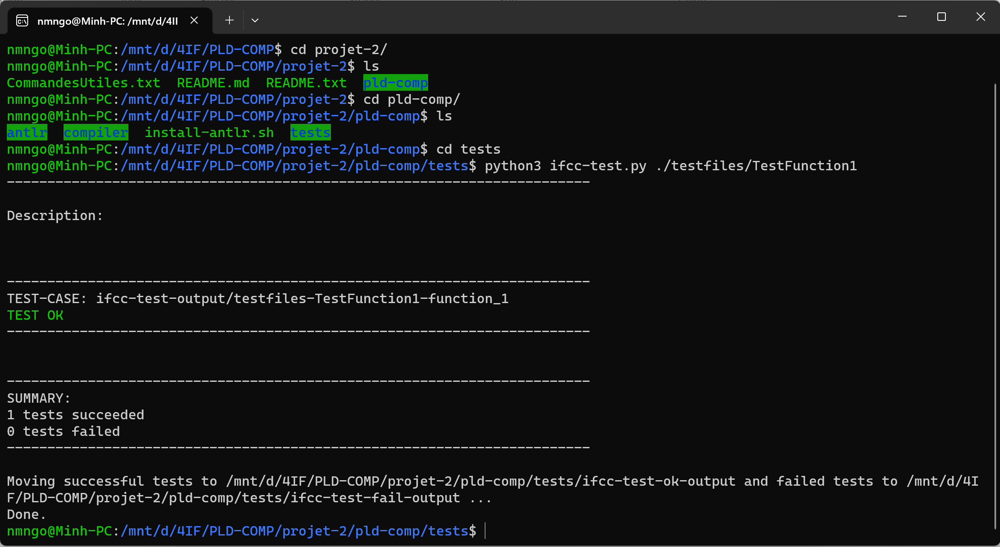

## Compilateur C vers Assembleur:
Programmé par l'hexanôme H4243 4IF INSA LYON:
    TABAKH Khalil, QI Jiaqi, PHUNG Minh, NGO Ngoc Minh, ALPOU Yannick, BAILLEUX Henri, MOUSSET Maxime

### Documentation utilisateur:

        -- Aide pour compiler un programme:

Dans le dossier /compiler
    Créer le programme "mon_programme.c"

    $make
    $./ifcc mon_programme.c > mon_programme.s

    mon_programme.s contient le code assembleur du programme

        -- Fonctionnalités De notre Compilateur : 

### Programme basique C:
    int main() {
     return 42;
    }
test1_1

### Déclaration de variables:
    int a=8;
    int b=5;
    int c=a;
    return c;
test1_2

### Affectation d'une variable:
    int a=8;
    int b=5;
    b=a;
    return b;
test1_3

### Déclaration et Affectation de plusieurs variables en une instruction: /!\ Fonctionnement différent de gcc : toutes les variables sont initialisées à la même valeur
    int a,b,v;
    a,b,v=12;
    return a,b,v;
test1_4

### Détection de non déclaration:
    int c=a;
    return c;
test1_5

### Détection des multiples déclarations:
    int a,b;
    int a;
    return 0;
test1_6

### Expressions Arithmétiques (=,+,-,*,/,()):
    int b,c;
    int a=17;
    b=42+a;
    c = a*b - (b*b +12)*7;
    return c+46*(6-12);
test1_7

### Comparateurs:
    int a = 7;
    int b = 9;
    int c = 11;
    c = ((a+b) > (a*3));
test1_8

### If..Else:
   int a = 7;
   if(a == 9) {
      a = 1;
   }else{
      a = 0;
   }
test1_9

### While:
    int a = 3;
    while (a < 7) {
        a = a + 1;
    }
test1_10

### Fonctions: /!\ On n'obtient un résultat différent à l'éxecution
    int add(int a, int b) {
        return a + b;
    }

    int main() {
        int a = 2;
        int b = 3;
        a = add(b, 3);
        return a;
    }
test1_11

 
 		   -- Non implémenté: :
### Mettre un chiffre/un symbole dans un nom de variable: 
    int x42 = 42;
    return x42;

### Boucles: For

### Adressage

### Types différents de int

### Utilisation de Char

### Tableaux

### Opérateurs unaires

## Documentation Développeur:

Dans le dossier /compiler
    Voir l'arbre AST d'un programme:
        $make gui FILE=programme_test.c
        
### Création et lancement des tests
- Créer un dossier dans "./pld-comp/tests/testfiles". Par ex: nom "TestAdd1"
- Créer un fichier .c pour faire le test (par ex: "test.c", ".c" est obligatoire)
- Créer un fichier "description" (création n'est pas obligatoire mais le nommage "description" est obligatoire,
pour que le ifcc-test.py puisse le lire)
- Va dans ce chemin "./pld-comp/tests"
- Lancer la commande "python3 ifcc-test.py ./testfiles/TestAdd1" pour compiler le test	

Les sorties des tests passés sont dans le dossier "./pld-comp/tests/ifcc-test-ok-output"
Les sorties des tests échoués sont dans le dossier "./pld-comp/tests/ifcc-test-fail-output"

### Indication de développement:
    
    grammaire : dans ifcc.g4
    
    Makefile : ($make) génère le dossier compiler/generated
    
    Visiteur : Le visiteur est un programme visitant l'arbre AST du programme compilé correspondant à la grammaire
               Le visiteur de base ifccBaseVisitor est généré par le make. Il contient une fonction pour chaque mot non-terminal de la grammaire.
               Le Visiteur de base parcours l'arbre recursivement sans rien faire.
               On peut créer un visiteur héritant de ifccBaseVisitor pour changer les fonctions lors de la visite d'un mot de l'arbre.
               Il faut créer le nouveau visiteur dans main.cpp pour qu'il parcours l'arbre.

               Les visiteurs existants sont :
               DeclarationCheckVisitor qui parcours l'arbre en vérifiant que les variables dans les expressions ont toutes été déclarées.
               CFGVisitor qui crée l'IR et qui pour chaque mot visité de l'arbre ajoute les bons blocs et instructions au CFG.

    	       L'IR: IR.cpp contient la classe CFG qui contient les Block qui contiennent les instructions.
               Après la visite de l'arbre et l'ajout des blocs au CFG dans CFGVisitor, on appele gen_asm.
               gen_asm parcours les différents blocs et instructions et écrit l'assembleur correspondant aux instructions.
               On peut aussi génerer du pseudo code avec gen_pseudo code...

    Etapes pour ajouter une nouvelle fonctionnalité:
          - ajouter les types instructions et mots nécéssaires dans la grammaire.
          - regénèrer les visiteurs de base avec make.
          - Ecrire dans les méthodes de CFGVisitor les ajouts au bloc courrant du CFG des suites d'instructions correspondant à la fonctionnalité.
          - ajouter si besoin les nouveaux types d'instruction dans IRinstr et créer pour chacun la classe IrInstrMonInstr ainsi que ses méthodes de génération de code 	    dans IR.h et IR.cpp.
          - Créer un test.c utilisant la fonctionnalité. 
            La visite de l'arbre du programme de test doit identifier la fonctionnalité,
            La suite d'instructions correspondante doit être ajoutée au CFG
            et son code bien généré dans le test.s
